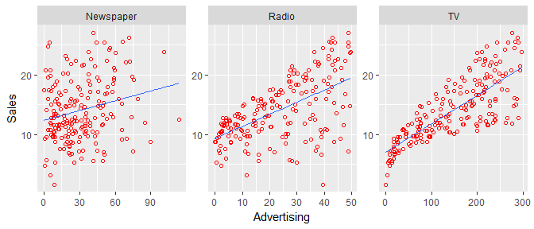
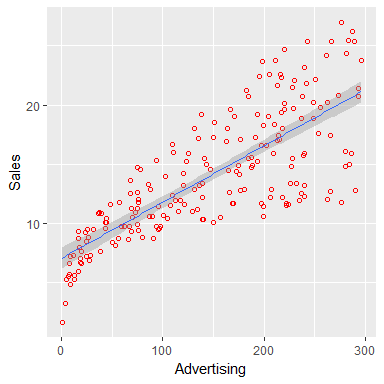
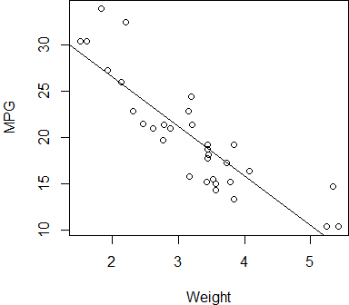
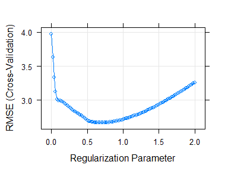
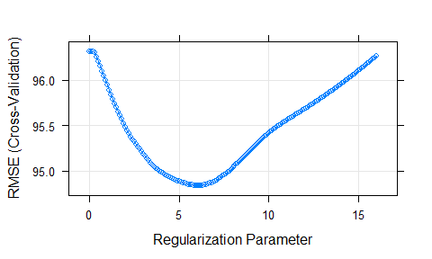

Practical Data Science using R </br> Lesson 6: The Linear Regression
================
Maher Harb, PhD </br> Assistant Professor of Physics </br> Drexel University

About the lesson
----------------

-   This lesson introduces the most basic of the statistical learning methods: the linear regression

-   We'll learn how to build a linear regression in R with single and multiple variables

-   We'll learn how to interpret the results of the linear regression

-   We'll also learn how to use regularization to shrink the regression coefficients

-   And finally, we'll learn how to extend the model to include non-linear relationships and interactions

The linear regression
---------------------

-   The linear regression assumes a linear relationship between predictors and outcome

-   In reality, relationships are seldom linear

-   Yet, the statistical concepts introduced through this simple model apply to the more complex learning methods

-   Having a good understanding of the linear regression cannot be overstated

-   We'll introduce the linear regression through the sales-advertising data we've encountered in the previous lesson

The sales-advertising relationship
----------------------------------



Questions of interest:

*Is there a relationship between advertising budget and sales? How strong is this relationship? Is the relationship linear? How accurately can we estimate the effect of each medium on sales? How accurately can we predict future sales? Is there synergy among the advertising media?*

The sales-advertising relation
------------------------------

Let's start by considering a single predictor, TV advertising

The single predictor regression equation is *Y* = *β*<sub>0</sub> + *β*<sub>1</sub>*X*

What we mean by the equation is:

sales = *β*<sub>0</sub> + *β*<sub>1</sub> × TV
 *β*<sub>0</sub> and *β*<sub>1</sub> are two unknown constants (regression coefficients)

Our goal is to estimate *β*<sub>0</sub> and *β*<sub>1</sub> by fitting a model on the training data

More formally, we are trying to find $\\hat{\\beta}\_0$ and $\\hat{\\beta}\_1$ such that the prediction of *Y* on the basis *x* = *X* is

$$\\hat{y} \\approx \\hat{\\beta}\_0 + \\hat{\\beta}\_1 x$$

Estimating the regression coefficients
--------------------------------------

For this simple single-predictor problem, estimating *β*<sub>0</sub> and *β*<sub>1</sub> implies finding the line of best fit to the data

This is done by minimizing some measure of deviation between predictions based on fit ($\\hat{y}$) and observations (*y*)

The most straight forward approach involves minimizing the residual sum of squares (RSS) defined as

$$\\textrm{RSS}=\\sum\_{i=1}^{n}{(y\_i-\\hat{y}\_i)}^2 $$

Note that RSS and MSE are closely related:

$$\\textrm{MSE}=\\frac{1}{n}\\sum\_{i=1}^{n}{(y\_i-\\hat{y}\_i)}^2 = n \\times \\textrm{RSS}$$

Fitting a linear regression in R
--------------------------------

Fortunately, we don't have to worry about implementing an optimization algorithm

Instead, we use `lm` to fit a linear regression:

``` r
mod_adv <- lm(sales ~ TV, df_adv)
mod_adv
```

    ## 
    ## Call:
    ## lm(formula = sales ~ TV, data = df_adv)
    ## 
    ## Coefficients:
    ## (Intercept)           TV  
    ##     7.03259      0.04754

Fitting a linear regression in R
--------------------------------

These are some useful metrics we should examine:

``` r
summary(mod_adv)$coefficients
```

    ##               Estimate  Std. Error  t value    Pr(>|t|)
    ## (Intercept) 7.03259355 0.457842940 15.36028 1.40630e-35
    ## TV          0.04753664 0.002690607 17.66763 1.46739e-42

``` r
summary(mod_adv)$r.squared
```

    ## [1] 0.6118751

``` r
summary(mod_adv)$adj.r.squared
```

    ## [1] 0.6099148

Model performance
-----------------

Model performance is assessed against a model that does not use any predictors

In the absence of predictors, the best we can do is assign the mean of the response ($\\bar{y}$) to any value of *x*

In this case, the residual sum of square (RSS) is referred to as total sum of squares (TSS)

$$\\textrm{TSS}=\\sum\_{i=1}^{n}{(y\_i-\\bar{y}\_i)}^2 $$
 The **R-squared** metric tells us how much of the variation in *y* is explained by the model

$$ \\textrm{R-squared} = \\frac{\\textrm{TSS}-\\textrm{RSS}}{\\textrm{TSS}} $$

Model performance
-----------------

In order to avoid overfitting, we can adopt a slightly modified version of R-squared

$$ \\textrm{Adjusted R-squared} =1 -  \\frac{(\\textrm{1 - R-squared})(n-1)}{n-p-1} $$

*n* is the number of observations

*p* is the number of predictors

The Adjusted R-squared combats overfitting by penalizing models that are highly flexible (large *p*)

The `lm` model
--------------

The model we fitted to the advertising data contains many useful pieces of information:

``` r
names(mod_adv)
```

    ##  [1] "coefficients"  "residuals"     "effects"       "rank"         
    ##  [5] "fitted.values" "assign"        "qr"            "df.residual"  
    ##  [9] "xlevels"       "call"          "terms"         "model"

``` r
mod_adv$coefficients
```

    ## (Intercept)          TV 
    ##  7.03259355  0.04753664

``` r
head(mod_adv$residuals)
```

    ##          1          2          3          4          5          6 
    ##  4.1292255  1.2520260  1.4497762  4.2656054 -2.7272181 -0.2461623

Interpretation of the slope
---------------------------



The slope *β*<sub>1</sub> = 0.0475 suggests that for every unit increase in TV advertising, sales increase on average by 0.0475 units

Statistical significance of the relation
----------------------------------------

In statistics, the problem of relating sales to TV advertising can be restated as:

H<sub>*o*</sub> (Null hypothesis): There is no relationship between TV advertising and sales (*β*<sub>1</sub> = 0)

H<sub>1</sub> (Alternative hypothesis): There is a relationship between TV advertising and sales (*β*<sub>1</sub> ≠ 0)

The value of *β*<sub>1</sub> of 0.0475 on its own does not allow us to reject or fail to reject the null hypothesis

We have to look into the confidence interval or the *p*-value

Statistical significance of the relation
----------------------------------------

The information we need is obtained as follows:

``` r
summary(mod_adv)$coefficients
```

    ##               Estimate  Std. Error  t value    Pr(>|t|)
    ## (Intercept) 7.03259355 0.457842940 15.36028 1.40630e-35
    ## TV          0.04753664 0.002690607 17.66763 1.46739e-42

The *p*-value and standard error suggest that there is indeed a relationship between TV advertising and sales

Therefore, we reject the null hypothesis

What is the probability the we made a mistake? (i.e. that the null hypothesis we rejected is true)

It is 10<sup>−42</sup>! i.e. extremely unlikely

Now is your turn to practice!
-----------------------------

The `mtcars` dataset can be loaded into R by calling:

``` r
data(mtcars)
```

Build a linear regression model to investigate whether a car's weight can be used to predict its fuel consumption (mpg).

Predicting car's mpg
--------------------

    ##              Estimate Std. Error   t value     Pr(>|t|)
    ## (Intercept) 37.285126   1.877627 19.857575 8.241799e-19
    ## wt          -5.344472   0.559101 -9.559044 1.293959e-10

    ## [1] 0.7445939

The relationship between weight and mpg is statistically significant

Furthermore, the weight of a car explains ~74% of the variation in the mpg

Predicting car's mpg
--------------------

Here's how to plot the regression line in Base R:



Making predictions
------------------

Back to the sales-advertising data

Now that we've built the model, we can use `predict` to make predictions:

``` r
df <- data_frame(TV = c(0, 50, 100, 15, 200, 250, 300))
predict(mod_adv, newdata = df)
```

    ##         1         2         3         4         5         6         7 
    ##  7.032594  9.409426 11.786258  7.745643 16.539922 18.916754 21.293586

This is equivalent to applying the regression formula:

``` r
mod_adv$coefficients[1] + df$TV * mod_adv$coefficients[2]
```

    ## [1]  7.032594  9.409426 11.786258  7.745643 16.539922 18.916754 21.293586

Multiple linear regression
--------------------------

TV advertising explains only about 61% of the variation in sales:

``` r
summary(mod_adv)$adj.r.squared
```

    ## [1] 0.6099148

We wish to expand our model to add the other advertising media. The new regression equation would be

*Y* = *β*<sub>0</sub> + *β*<sub>1</sub>*X*<sub>1</sub> + *β*<sub>2</sub>*X*<sub>2</sub> + *β*<sub>3</sub>*X*<sub>3</sub>

corresponding to

sales = *β*<sub>0</sub> + *β*<sub>1</sub> × TV + *β*<sub>2</sub> × Radio + *β*<sub>3</sub> × Newspaper

Let's see how this's implemented in R

Multiple linear regression
--------------------------

We use the same `lm` function:

``` r
mod_adv_multi <- lm(sales ~ TV + Radio + Newspaper, df_adv) 
mod_adv_multi
```

    ## 
    ## Call:
    ## lm(formula = sales ~ TV + Radio + Newspaper, data = df_adv)
    ## 
    ## Coefficients:
    ## (Intercept)           TV        Radio    Newspaper  
    ##    2.938889     0.045765     0.188530    -0.001037

Note, we could've instead called:

``` r
mod_adv_multi <- lm(sales ~ ., df_adv)
```

Interpretation of the coefficients
----------------------------------

The coefficient *β*<sub>1</sub> = 0.0457 suggests that for every unit increase in TV advertising, sales increase on average by 0.0457 units, ***if all other variables are held constant***

The interpretation is similar to that of the single-variable linear regression, with only a subtle difference: when explaining the effect of a change in one variable, the other variables have to be held constant

How well does the model perform?

``` r
summary(mod_adv_multi)$adj.r.squared
```

    ## [1] 0.8956373

Statistical significance of results
-----------------------------------

``` r
summary(mod_adv_multi)$coefficients
```

    ##                 Estimate  Std. Error    t value     Pr(>|t|)
    ## (Intercept)  2.938889369 0.311908236  9.4222884 1.267295e-17
    ## TV           0.045764645 0.001394897 32.8086244 1.509960e-81
    ## Radio        0.188530017 0.008611234 21.8934961 1.505339e-54
    ## Newspaper   -0.001037493 0.005871010 -0.1767146 8.599151e-01

The *p*-value of the Newspaper variable does not support including Newspaper advertising as a predictor of sales

We may benefit from fitting a model with only TV and Radio advertising as predictors

Model performance
-----------------

Using only TV and Radio advertising as predictors:

``` r
mod_adv_multi <- lm(sales ~ TV + Radio, df_adv)
summary(mod_adv_multi)$coefficients
```

    ##               Estimate  Std. Error   t value     Pr(>|t|)
    ## (Intercept) 2.92109991 0.294489678  9.919193 4.565557e-19
    ## TV          0.04575482 0.001390356 32.908708 5.436980e-82
    ## Radio       0.18799423 0.008039973 23.382446 9.776972e-59

``` r
summary(mod_adv_multi)$adj.r.squared
```

    ## [1] 0.8961505

We get comparable performance but with one less variable. This is a more desirable model!

Your turn to practice!
----------------------

Expand on the linear regression model of the cars mpg by adding a second variable. It's up to you to choose which variable to add to the model, but base your choice on your subject knowledge rather than the performance of the model.

Check statistical signficance of the result and compare the performance of the model to the one with a single variable.

Predicting car's mpg
--------------------

Let's see if including the transmission type improves the model:

    ##                Estimate Std. Error     t value     Pr(>|t|)
    ## (Intercept) 37.32155131  3.0546385 12.21799285 5.843477e-13
    ## wt          -5.35281145  0.7882438 -6.79080719 1.867415e-07
    ## factor(am)1 -0.02361522  1.5456453 -0.01527855 9.879146e-01

    ## [1] 0.7357889

Notice, `factor` is used to convert `am` to a categorical variable

Predicting car's mpg
--------------------

``` r
summary(mod_cars)$coefficients
```

    ##                Estimate Std. Error     t value     Pr(>|t|)
    ## (Intercept) 37.32155131  3.0546385 12.21799285 5.843477e-13
    ## wt          -5.35281145  0.7882438 -6.79080719 1.867415e-07
    ## factor(am)1 -0.02361522  1.5456453 -0.01527855 9.879146e-01

Interpretation of the regression coefficients:

-   A unit increase in weight decreases mpg on average by 3.2, for the same type of transmission

-   Automatic transmission (am=1) decreases mpg on average by 0.02 over manual transmission, if the weight is held fixed

But notice the extremely large standard error for variable am. This variable should not be included in the model

Correlations between variables
------------------------------

Back to the sales-advertising data. Here's a model with Newspaper advertising as the only predictor:

``` r
mod_adv <- lm(sales ~ Newspaper, df_adv)
summary(mod_adv)$coefficients
```

    ##               Estimate Std. Error   t value     Pr(>|t|)
    ## (Intercept) 12.3514071 0.62142019 19.876096 4.713507e-49
    ## Newspaper    0.0546931 0.01657572  3.299591 1.148196e-03

And the one with all media as predictors:

``` r
mod_adv_multi <- lm(sales ~ ., df_adv)
summary(mod_adv_multi)$coefficients
```

    ##                  Estimate  Std. Error    t value     Pr(>|t|)
    ## (Intercept)  3.0052094201 0.394208197  7.6234067 1.055423e-12
    ## Market      -0.0005798278 0.002099249 -0.2762072 7.826814e-01
    ## TV           0.0457759196 0.001398791 32.7253442 3.846906e-81
    ## Radio        0.1883831760 0.008647954 21.7835542 3.948591e-54
    ## Newspaper   -0.0012433262 0.005931889 -0.2096004 8.341984e-01

Correlations between variables
------------------------------

It might seem odd that the relationship between Newspaper and sales is statistically significant in the single-variable model, but not in the all-variables model

This is a very common effect that is due to **correlations** between variables

``` r
cor(df_adv[, c("TV", "Radio", "Newspaper")])
```

    ##                   TV      Radio  Newspaper
    ## TV        1.00000000 0.05480866 0.05664787
    ## Radio     0.05480866 1.00000000 0.35410375
    ## Newspaper 0.05664787 0.35410375 1.00000000

Correlations between variables make the task of choosing predictors and interpreting results more challenging

Nobel wins vs. Chocolate consumption
------------------------------------

The strong correlation between per capita Nobel wins and per capita chocolate consumption is most likely due to correlation with a third variable


Variable selection
------------------

-   The previous examples suggest that a possible strategy for optimizing a model is to try all combinations of variables and select the one that results in the highest adjusted R-squared

-   This strategy is ok if the number of predictors is small, but it is computationally expensive (scales as 2<sup>*p*</sup>)

-   When the number of variables is large, possible variable selection strategies include:

    -   **Forward selection**: Start with no variables, and add one variable at a time, by choosing the one that produces the best improvement in the adjusted R-squared

    -   **Backward selection**: Start with all variables, and subtract one variable at a time, by choosing the one that produces the best improvement in the adjusted R-squared

Your turn to practice!
----------------------

Rebuild the regression model of the cars mpg by selecting the two predictors that result in the highest adjusted R-squared. Use the forward selection method.

Check statistical significance of the result and compare the performance of the model to the previous mpg models.

Predicting car's mpg
--------------------

It turns out that this model produces the highest adjusted R-squared:

    ## [1] 0.8200146

But the process for selecting the "right" predictors was tedious

Is there a better approach?

Regularization
--------------

The idea behind regularization is to constrain the regression coefficients within the optimization process

Recall that a least square fit minimizes the RSS:

$$\\textrm{minimize } \\textrm{ RSS} = \\sum\_{i=1}^{n}{(y\_i-\\hat{y}\_i)}^2$$

**Lasso regularization** adds a term to the RSS:

$$\\textrm{minimize } \\textrm{ RSS} + \\lambda \\sum\_{j=1}^{p}{\\mid \\beta \_j \\mid} $$

This additional term forces some coefficients to collapse to zero, thereby aiding in variable selection; But there's now a hyper-parameter to tune: *λ*

What is a hyper-parameter
-------------------------

A hyper-parameter is a parameter that affects the structure of the trained model, but does not directly go into the calculation of the response variable

Example, in a regularized linear regression, *y* is estimated from the regression coefficients, *β*<sub>1</sub>, *β*<sub>2</sub>, ...

*λ* is not directly used to estimate *y*, but it does influence the values of *β*<sub>1</sub>, *β*<sub>2</sub>, ... through the optimization process

Think of *λ* as the knob we can adjust to tune our model

some models have no hyper-parameters (a simple linear regression), other have many hyper-parameters (a deep neural network)

Implementing Lasso regularization
---------------------------------

Once again, implementing the optimization algorithm is something we don't need to worry about

This is handled by the `glmnet` package, which we'll also use for the Logistic regression (Lesson 7)

But rather than calling `glmnet` directly, we'll work with the `caret` package to standardize our approach to using various machine learning algorithms

With `caret`, we can do a lot of the pre-processing of data and cross-validation splits on the fly

Example, for regularization the variables need to be scaled and centered before training the model

Lasso regularization
--------------------

Here's the `caret` implementation of training a linear model:

``` r
library(caret)
set.seed(1234)
trControl <- trainControl(method = "cv", number = 5)
grid <- expand.grid(alpha = 1, lambda = seq(0, 2, length = 101))
mod <- train(mpg ~ ., mtcars, method = "glmnet", tuneGrid = grid, 
    trControl = trControl, metric = "RMSE", preProcess = c("center", 
        "scale"))
par(mar = c(4, 4, 0, 0))
plot(mod)
```



Lasso regularization
--------------------

``` r
Beta <- coef(mod$finalModel, 0.9)
Beta
```

    ## 11 x 1 sparse Matrix of class "dgCMatrix"
    ##                      1
    ## (Intercept) 20.0906250
    ## cyl         -1.5691515
    ## disp         .        
    ## hp          -0.7478852
    ## drat         .        
    ## wt          -2.5944148
    ## qsec         .        
    ## vs           .        
    ## am           .        
    ## gear         .        
    ## carb         .

``` r
R2 <- mod$results$Rsquared[which(grid$lambda == 0.9)]
1 - (1 - R2) * (nrow(mtcars) - 1)/(nrow(mtcars) - sum(Beta != 
    0) - 1)
```

    ## [1] 0.8417356

Non-linear relationships
------------------------

The linear regression can be tweaked to include non-linear relationships

For example, we may fit the sales data to a third order polynomial of TV advertising:

``` r
mod_adv <- lm(sales ~ poly(TV, 3), df_adv)
mod_adv
```

    ## 
    ## Call:
    ## lm(formula = sales ~ poly(TV, 3), data = df_adv)
    ## 
    ## Coefficients:
    ##  (Intercept)  poly(TV, 3)1  poly(TV, 3)2  poly(TV, 3)3  
    ##       14.023        57.573        -6.229         4.007

``` r
summary(mod_adv)$adj.r.squared
```

    ## [1] 0.616216

Interactions
------------

We can also add interactions between variables

For example, what if there's a synergistic effect between TV and Radio advertising?

``` r
mod_adv <- lm(sales ~ TV + Radio + TV * Radio, df_adv)
mod_adv
```

    ## 
    ## Call:
    ## lm(formula = sales ~ TV + Radio + TV * Radio, data = df_adv)
    ## 
    ## Coefficients:
    ## (Intercept)           TV        Radio     TV:Radio  
    ##    6.750220     0.019101     0.028860     0.001086

``` r
summary(mod_adv)$adj.r.squared
```

    ## [1] 0.9672975

Your turn to practice!
----------------------

The credit dataset contains demographic data and credit ratings for a number of people. Use Lasso regularization as demonstrated previously to determine which variables best predict the credit Rating.

The dataset can be downloaded from:

`https://raw.githubusercontent.com/maherharb/MATE-T580/master/Datasets/ISLR_credit.csv`

Credit Rating
-------------

Notice that Limit and Rating are ~100% correlated. Including the Limit as predictor does not make sense! But if we remove Limit and search within the proper *λ* range:



*λ* = 6 seems a reasonable value for the hyper-parameter

Credit Rating
-------------

The coefficients are:

    ## 10 x 1 sparse Matrix of class "dgCMatrix"
    ##                             1
    ## (Intercept)        354.940000
    ## Income             116.517359
    ## Cards                4.358925
    ## Age                  .       
    ## Education            .       
    ## GenderMale           .       
    ## StudentYes           .       
    ## MarriedYes           .       
    ## EthnicityAsian       .       
    ## EthnicityCaucasian   .

    ## [1] "adjusted R-squared: 0.583119082724371"

Note, it is legally prohibited to use race or gender as predictors

Concluding remarks
------------------

-   The linear regression should be the first statistical learning approach to apply to a regression problem

-   Even if the regression performs poorly, the result is considered a benchmark to compare against when applying more sophisticated machine learning methods

-   The advantage of the linear regression is the simplicity of the model, making it very easy to interpret and computationally inexpensive to run on a large dataset

-   Furthermore, it allows one to experiment with nonlinear terms and interactions as a way to engineer new features with predictive value

-   For large number of predictors, it is recommended to use Lasso regularization (alpha = 1) for selection of predictors
